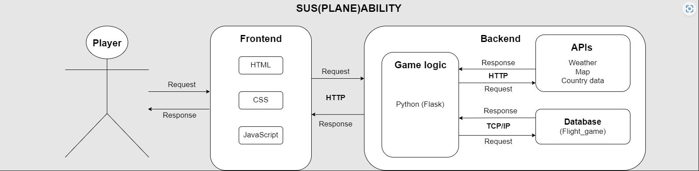

# Table of Contents
[Introduction](#introduction)

[Scope](#scope)

[Current State](#current-state)

[Vision](#vision)

[Game Concept](#game-concept)

[Game Objective](#game-objective)

[Game Rules](#game-rules)

[Dice of Fate (Conditions)](#dice-of-fate-conditions)

[Functional Requirements](#functional-requirements)

[Quality Requirements](#quality-requirements)

[Software Architecture](#software-architecture)

## Introduction
This documentation specifies the stages of design, functionality, gameplay of the game with the title “SUS(PLANE)ABILITY”. This is web-based game, developed by the “Group-2”. It's based on elements discussed in various meetings held since 1st of December 2022.

The study is dedicated to final game development. This game is the extended version of preliminary game. We made a preliminary version of this game or prototype during software 1. This final version of game is developed that satisfies the requirements of software 2 final project assignment.

SUS(PLANE)ABILITY is the flight simulator game. This is the graphical version of game. Players will play this game by giving input using keyboard and mouse.  Final output is displayed in web browser.

Games are the place to try new ideas and to experiment with established theories. In the web-based flight simulator game project, game is programmed by python, JavaScript, html and CSS and used PyCharm IDE, MariaDB database and web browser to execute the program.

This document includes the game story, vision, functional and quality requirements and software architecture.

## Scope
This document is intended to read by fellow programmers, supervisors and teachers. This document contains brief description of the technical and non-technical aspects of the Flight simulator game project. This can be used as the road map for the future development of game and to extend the game to a new dimension.
## Current State
“SUS(PLANE)ABILITY” is a fully functional web-based game. This game is developed by following the instruction given by the project requirement document. Game is stored and run-in local server, not in external web server. 
## Vision
The purpose of the game is to make an interactive gaming experience for the player and game as per the requirement of final project work of software 2. It is possible to play the game by using keyboard and mouse only.
## Game Concept
To live in a space station, what an honor. Years ago, you (player) were selected among millions to be one of the few lucky individuals to take part in an experiment started by the World Government. As one of the chosen few you had the opportunity to look down upon earth in all its glory. Months later you notice that the earth no longer looks as it once did. As it turns out this was the reason behind this whole experiment. 

Earth doesn't have much more time. The corrupt world you see before you are a product of the unsustainable lifestyle of humans. No one else on the space station shared your worries with the corruption taking over Earth. You knew you had to act, even if you were alone. With your trusty space-made purification gun, and only a few minutes to spare you hijack an escape pod and make your way to Earth to purify the spreading corruption. Landing right outside of the airport, you come across an old airplane with limited co2 amount.

Fly around to all the countries and purify Earth as you go. The fate of Earth is in your hands; however, your fate is in hands of bored higher beings that like to throw dice, with enough luck you may be able to succeed.
## Game Objective
Player has to fly to all the EU countries and purify them. For every 10 collected countries the corruption will be decreased by 20 percent.
## Game Rules
- Player has 3 minutes to fly to all the countries in the game. If the time runs out the world will be destroyed and game is over.
- If player exceed the CO2 budget player will pollute the world even more and game is over.
- Every time Player flies the dice of fate will be rolled.

## Dice of Fate (Conditions)
- 1: Game Over. Player is dead.
- 2: Plane had to take an unexpected detour. Double the amount of Co2 consumed.
- 3: Planes GPS breaks and you end up somewhere else.
- 4: Plane had to return to the previous airport. Full amount of Co2 wasted for that trip.
- 5: Player got a 50% Co2 refund for this flight.
- 6: Player got a full Co2 refund for this flight.

## Functional Requirements
Start game

Player starts the game by entering his/her name and is assigned a random location in Europe as starting point. 

Fly

Player wants to travel all of 50 countries of Europe. Player can choose a country to fly to from the map.

Dice fate

After player chooses a country to fly to, player will get the notification based on the dice fate. Plane can fly to destination or come back to the previous airport or die (game over).

Game over 

After player fly all the 50 countries, he will get notification that ‘Congratulations! You purified all the 50 countries!’.

## Quality Requirements
- All the class and functions in back end is working properly and not providing error
- Insert player name and create row with id in database 
- Fetch ICAO from database mark all the airports in map
- Display the distance of destination airport from the current airport before fly
- Display the goal in web page and update it 
- Fetch the real time weather from API and display it in screen
- Fetch the country description from the API and display it in screen
- Game timer is working and game over after 3 minutes
- Html and CSS is valid and working properly 
#
## Software Architecture 

